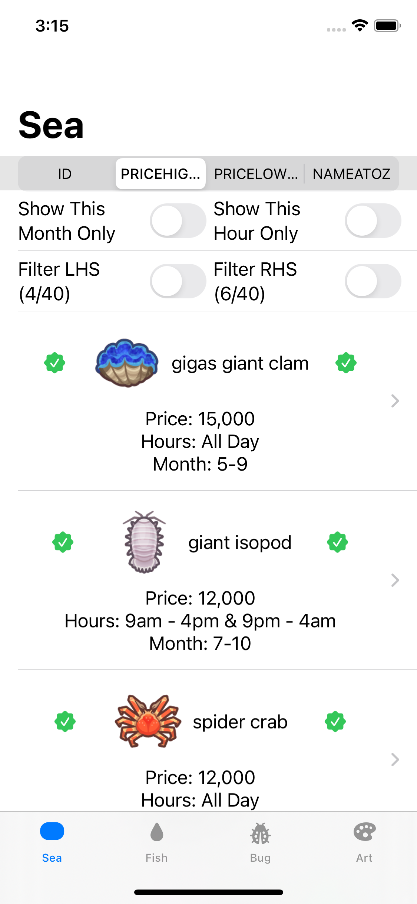
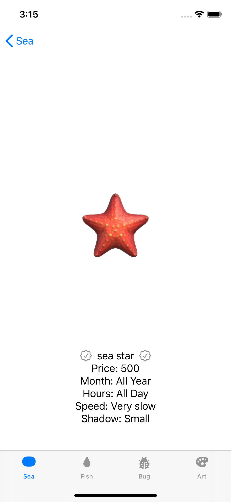
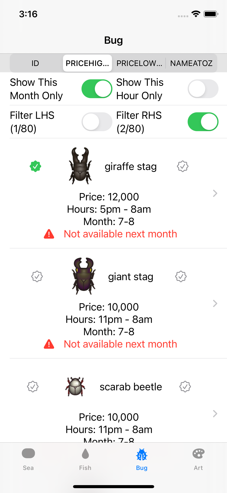
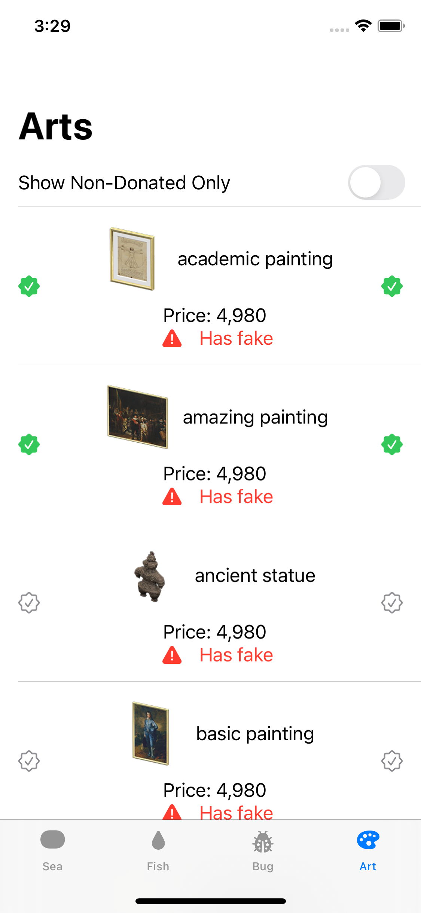

# AnimalCrossingData
This is a simple app to display and track the critters and art collections in Animal Crossing: New Horizons.
The four tabs at the bottom switch between sea creatures, fish, bugs, and art collections. The critter list displays the icon, name, price, active hours, and active months. Click it for a detailed view about its speed, rarity, location etc. The small checkmarks may be used to track the collection progress for at most two players. When a critter is not available next month, a small warning sign will be attached to it.

One may check what critters they haven't caught are availabe right now by combining the available filters.

Multiple sort methods (id, price high to low, price low to high, and name a to z) are available to critters. 

## Credits
Thanks to https://github.com/alexislours/ACNHAPI for all the data and icons/images.

## Disclaimer
This is a fan-made app. All assets found on the site and the repository are the sole property of Nintendo and are only used for non-commercial and educational purpose.
